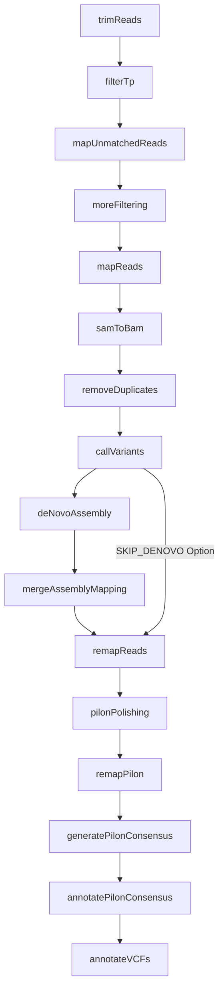

# Tpallidum WGS
This pipeline is intended for assembly and annotation of Treponema pallidum whole genomes.

This pipeline takes gzipped fastq files and outputs consensus fastas annotated with Prokka. Running on the cloud is recommended due to memory-intensive mapping steps. 

## Installation

1. Install [nextflow](https://www.nextflow.io/docs/latest/getstarted.html#installation).
   - Make sure you move nextflow to a directory in your PATH variable.
2. Install [docker](https://docs.docker.com/get-docker/).
3. Setup [nextflow tower](https://seqera.io/)

> [!WARNING]
Newer versions of java may have issues with spades, java 17.0.5 has been tested and works.

## Usage

This pipeline takes the location of gzipped fastqs as the input, no metadatafile required.

> [!NOTE]
> Fastqs must be gzipped

In your fastq directory run 
``` Bash
gzip *.fastq
```
to gzip all fastqs.

> [!NOTE]
> For paired fastqs the correct naming format is 
> Read 1: {Base}_R1.fastq.gz
> Read 2: {Base}_R2.fastq.gz

## Options
List commands for the pipline:
| Command  | Description |
| ---      | ---         | 
| `--INPUT`  | Input folder where gzipped fastqs are located. For current  directory, `./` can be used.
| `--OUTDIR` | Output folder for files produced from pipeline.
| `-resume`  | nextflow will pick up where it left off if the previous command was interrupted for some reason.
| `-with-trace` | Outputs a trace.txt that shows which processes end up in which work/ folders. 
|`--REFERENCE` |Reference used to map samples to, default is SS14 (NC_021508), options are: 
||`SS14` (NC_021508)
|| `Nichols` (NC_021490)
||`Endemicum` (NZ_CP007548)
||`Pertenue` (NC_016842)
|`--SKIP_DENOVO` |If running off the cloud, skips denovo assembly and generates fasta from mapping reads to reference
|`-profile`|`standard`: For less computationally intensive systems run locally, not reccommended
||`Cloud`: For running on the cloud adds more computational power for memory intensive steps, recommended
|`-c`|Add you nextflow config file to access cloud
|`-with-tower`|Monitor your run with nextflow tower 


Example Cloud:
```
nextflow run greninger-lab/Tpallidum_WGS_Pipeline -r main \
	--INPUT Example_Fastq/ \
	--OUTDIR Example_Output/ \
	-c your_nextflow_aws.config \
	-profile Cloud \
	-with-tower 
```

Example Cloud and custom reference:
```
nextflow run greninger-lab/Tpallidum_WGS_Pipeline -r main \
	--INPUT Example_Fastq/ \
	--OUTDIR Example_Output/ \
	--REFERENCE Nichols \
	-c your_nextflow_aws.config \
	-profile Cloud \
	-with-tower 
```

Example Local with skip denovo:
```
nextflow run greninger-lab/Tpallidum_WGS_Pipeline -r main \
	--INPUT Example_Fastq/ \
	--OUTDIR Example_Output/ \
	-profile standard \
	--SKIP_DENOVO
```

## Workflow



## Running example

Install [sratoolkit](https://github.com/ncbi/sra-tools/wiki/02.-Installing-SRA-Toolkit)

On Mac you can use brew:
```bash
brew install sratoolkit
```

Make an _Example_Fastq_ folder

```bash
mkdir Example_Fastq 
```

Enter Example folder 
```bash
cd Example_Fastq 
```

Download sample SRR24317982 from SRA and place it in the _Example_Fastq_ folder.

```bash
fasterq-dump SRR24317982 --split-files
```

gzip files

``` Bash
gzip *.fastq
```

Exit folder and use one of the example workflows to run example

``` Bash
cd ..
``` 

## Explanation of output

```
Example_Output/
├── TPA_filtered_fastqs                            # Unmatched reads from rRNA filter mapped TPA genome
├── VCF_Annotations                                # Annotations of snps with Snippy
│   └── SRR24317982
│       └── reference
│           ├── genomes
│           └── ref
├── deduped_bams                                    # Bams deduplicated with Picard
├── deduped_fastqs                                  # Fastqs deduplicated with Picard 
├── extra_filtered_fastqs_for_denovo                # fastqs filtered to map to tp reference with rRNA filter
├── finalconsensus_pilon_prokka_annotations         # Assembled fastas annotated with Prokka
├── finalconsensus_v2                               # Final assembled fastas
├── firstmap_sorted_bam                             # Reads that map to reference after filtering as bam file
├── mapSams                                         # Reads that map to reference after filtering as sam file
├── merged_assembly_mapping_consensus               # Merges assembly and mapping to make consensus sequence
├── pilon                                           # assemblies run through Pilon to fix misassemblies
├── rRNA_filtered_fastqs                            # First round of trimming mapping to rRNA
├── remapped_bams                                   # remap reads to assembly
│   └── SRR24317982
├── remapped_pilon_bams                             # remap reads to pilon assembly
│   └── SRR24317982
├── scaffold_bams                                   # Merges assembly and mapping to make consensus sequence 
├── trimmed_fastq                                   # Adapter trimmed fastqs using trimmomatic
├── unicycler_output                                # De novo assemble matched reads with Unicycler
│   └── SRR24317982
└── vcfs                                            # Variant annotation 
```

> [!NOTE]
If running this pipeline for Greninger Lab purposes please reference the guidelines for naming conventions and storage of fastqs and assemblies available in this directory: DRAFT Guidelines for TP sample and data storage.docx
